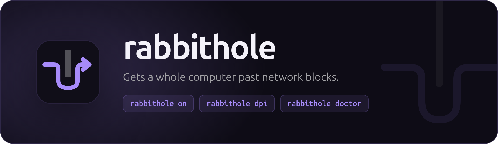
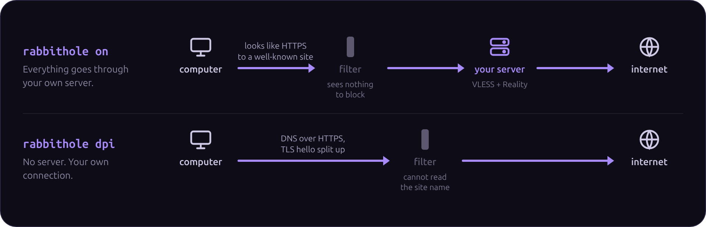

<p align="center">
  
</p>

<p align="center">
  <a href="https://github.com/matrixdurden/rabbithole/releases/latest"></a>
  
  <a href="https://github.com/SagerNet/sing-box"></a>
  <a href="LICENSE"></a>
</p>

<p align="center">
  <a href="#install">Install</a> ·
  <a href="#use">Use</a> ·
  <a href="#users">Users</a> ·
  <a href="#update">Update</a> ·
  <a href="#remove">Remove</a> ·
  <a href="#build">Build</a>
</p>

<br>

## Two modes



- **`rabbithole on`**: all traffic goes through your own server. To the network in between it looks like ordinary HTTPS to a well-known site (VLESS + Reality), so networks that block VPNs or SSH let it through.
- **`rabbithole dpi`**: no server. Traffic leaves over your own connection, but DNS is asked over HTTPS and every TLS handshake is split into several records, so a DPI filter can neither poison names nor read which site you open.

> [!NOTE]
> A server in a censored country meets the same filter on its way out, so it splits handshakes and asks DNS over HTTPS too.

## Install

### 1. Server

Only for `rabbithole on`. On a Linux machine with systemd that the internet reaches on TCP port 443:

```sh
curl -fsSL https://raw.githubusercontent.com/matrixdurden/rabbithole/main/install.sh | sh -s -- server
```

It asks for your sudo password, sets everything up, tests itself and prints a link.

### 2. Computers

**Windows**: open PowerShell, run this, and paste the link when asked, or press Enter for `rabbithole dpi` only:

```powershell
irm https://raw.githubusercontent.com/matrixdurden/rabbithole/main/install.ps1 | iex
```

**Linux**:

```sh
curl -fsSL https://raw.githubusercontent.com/matrixdurden/rabbithole/main/install.sh | sh -s -- client 'vless://…'
curl -fsSL https://raw.githubusercontent.com/matrixdurden/rabbithole/main/install.sh | sh -s -- dpi
```

A link is checked before anything is changed. Windows asks for administrator permission once; you can add a link later with `rabbithole client`.

### 3. Phones

Phones run both modes in the official [sing-box](https://sing-box.sagernet.org/clients/) app (App Store, Google Play), each as a profile: the one you start is the mode.

| Mode | How |
| --- | --- |
| **dpi** | In sing-box, add a remote profile with `https://github.com/matrixdurden/rabbithole/releases/latest/download/rabbithole-dpi.json`, or run `rabbithole phone` on a computer and scan the QR code it shows with the phone's camera. The app keeps the profile up to date. |
| **on** | `rabbithole phone` on a computer that has a link, or `rabbithole phone 'vless://…'` anywhere, puts a `.bpf` file on the desktop. Send it to the phone and open it with sing-box. |

> [!CAUTION]
> The `.bpf` file and the QR code hold the key to the server, so send the file only to yourself and show the code only to your own phone.

Hiddify and v2rayNG take the `vless://` link as it is, too: `rabbithole phone` also shows it as a QR code to scan with the app's own scanner.

## Use

```sh
rabbithole on        # all traffic goes through the server
rabbithole dpi       # your own connection, past DPI blocks
rabbithole off       # back to the normal connection
rabbithole           # ● on 203.0.113.7  /  ● dpi 198.51.100.4  /  ○ off
```

`rabbithole on` and `rabbithole dpi` switch between each other directly. On Windows none of them need administrator permission. WSL uses the Windows tunnel automatically.

**Local network.** Your local network (router, printer, `192.168.x.x`) never goes through the tunnel. With `rabbithole on`, the server's own IP address reaches the server itself, so SSH to it and web apps that listen only on the server's `127.0.0.1` work without going around through its router, and speed is capped by the server's upload speed.

**After a reboot** the tunnel is off until you turn it on, unless you run `rabbithole autostart on` (once; `off` undoes it). Then at boot it comes back as you left it: in `on` mode, in `dpi` mode, or off after `rabbithole off`. It first waits for the network; in `on` mode it also checks the server, and if the server does not answer within 90 seconds it stays off and the internet works as usual. `rabbithole on` checks the server too, and leaves everything as it is if the server does not answer. If the tunnel crashes, the computer falls back to its normal connection at once.

**On a new network**, `rabbithole doctor` measures what it does (sign-in page, DNS rewriting, DNS over HTTPS, site-name filtering, HTTPS inspection, whether the server is reachable) and says which mode will work. It saves the report to the desktop, for when that network blocks everything else. `rabbithole dpi` picks, each time it starts, the first DNS over HTTPS server the network lets through, and falls back to plain DNS if none does.

> [!WARNING]
> Close GoodbyeDPI or zapret before using rabbithole: they add fake packets that break connections through the tunnel, and `rabbithole dpi` does their job. `rabbithole` warns when they run.

## Users

On the server:

```sh
sudo rabbithole add ali     # prints a link for ali
sudo rabbithole del ali     # ali's link stops working
sudo rabbithole users
sudo rabbithole link ali    # prints ali's link again
```

The link is a standard `vless://` link, so phone apps such as Hiddify or v2rayNG accept it too; `rabbithole phone` shows it as a QR code for them. See [Phones](#3-phones).

## Update

```sh
rabbithole update
```

Installs the latest release if there is a newer one, checks its checksum, and restarts what was running. Keys, users and links stay as they are. Running the install command again does the same.

<details>
<summary><b>Coming from <code>tunel</code></b></summary>
<br>

Before v0.2.0 rabbithole was called `tunel`. `tunel update` cannot follow the rename, so run the install command once more on each machine (`… | sh -s -- update` on Linux). It takes over the `tunel` setup and removes it: the server keeps its keys and users, so links already handed out keep working, and a computer keeps its link, mode and autostart.

</details>

## Remove

```sh
rabbithole remove
```

Removes everything rabbithole added: the service, the network adapter, the settings, the `PATH` entry, and rabbithole itself (and the `~/.ssh/config` block that versions before v0.1.5 added). On a server it also removes the server and its keys.

## Build

With Go:

```sh
./build.sh      # dist/: Linux and Windows, amd64 and arm64, and checksums.txt
go test -tags with_utls,with_gvisor,badlinkname,tfogo_checklinkname0 -ldflags=-checklinkname=0 .
```

Pushing a `v*` tag builds and publishes a release, which the install scripts download.

<br>

<p align="center">
  <br>
  <sub>The tunnel engine is <a href="https://github.com/SagerNet/sing-box">sing-box</a>, built in. Like sing-box, rabbithole is licensed under the GPL-3.0.</sub>
</p>
